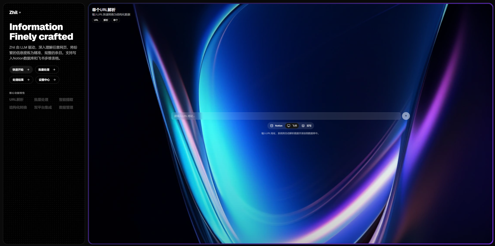

<div align="center">

  

**Turn any URL into structured Notion records with the power of LLM**  


---

*"Let every URL find its way into memory."*

</div>

## Overview

Zhil is a comprehensive URL information collection and storage system that transforms web content into structured database records. It features a modern Next.js frontend with a beautiful, responsive UI and a robust Python FastAPI backend powered by AI/LLM technology. The system supports **dual-platform storage** - simultaneously writing to both **Notion databases** and **Feishu Bitable** for maximum data security and accessibility.

 
 

### Key Features

- **Modern Web Interface**: Beautiful Next.js 14 frontend with TailwindCSS and shadcn/ui components
- **Intelligent Web Scraping**: Playwright-based scraping with JavaScript rendering support
- **AI-Powered Extraction**: Large Language Model (LLM) integration for structured data extraction
- **Dual-Platform Storage**: **Simultaneous writing to Notion and Feishu Bitable**
- **Dynamic Schema Adaptation**: Automatic field detection and LLM prompt adjustment for both platforms
- **Smart Data Normalization**: Intelligent data cleaning with platform-specific field formatting
- **Field Type Handling**: Proper handling of URL fields, date timestamps, and multi-select fields
- **Duplicate Detection**: URL-based deduplication with smart upsert operations
- **Batch Processing**: Support for bulk URL processing with progress tracking
- **Real-time Status**: Live processing status updates with progress indicators
- **History Management**: Persistent processing history with export functionality
- **RESTful API**: Comprehensive API endpoints with automatic documentation
- **Production Ready**: Comprehensive testing, logging, and error handling

## Architecture

### System Components

```
┌─────────────────────────────────────────────────────────────────┐
│                    Next.js Frontend                            │
│                (Modern React UI Interface)                      │
└─────────────────┬───────────────────────────────────────────────┘
                  │
┌─────────────────▼───────────────────────────────────────────────┐
│                     FastAPI Web Service                        │
│                    (RESTful API Interface)                     │
└─────────────────┬───────────────────────────────────────────────┘
                  │
┌─────────────────▼───────────────────────────────────────────────┐
│                   Main Pipeline                                │
│                 (Core Processing)                              │
└───┬─────────┬─────────┬─────────┬─────────┬───────────────┬─────┘
    │         │         │         │         │               │
┌───▼───┐ ┌───▼───┐ ┌───▼───┐ ┌───▼───┐ ┌───▼───┐     ┌───▼───┐
│ Web   │ │ LLM   │ │ Data  │ │Notion │ │Feishu │     │Config │
│Scraper│ │Extract│ │Normal │ │Schema │ │Bitable│     │ Mgmt  │
└───────┘ └───────┘ └───────┘ └───────┘ └───────┘     └───────┘
                              │         │
                         ┌────▼────┐ ┌──▼──┐
                         │Notion   │ │Feishu│
                         │Writer   │ │Writer│
                         └─────────┘ └──────┘
```

### Technology Stack

- **Frontend**: Next.js 14, React 18, TypeScript, TailwindCSS, shadcn/ui
- **Backend**: Python 3.8+, FastAPI, Uvicorn
- **Web Scraping**: Playwright, html2text
- **AI/ML**: OpenAI SDK (Qwen model), Function Calling
- **Databases**: Notion API, Feishu Bitable API
- **State Management**: Zustand
- **HTTP Client**: Axios, httpx
- **Testing**: pytest, httpx
- **Utilities**: pydantic, cachetools, fuzzywuzzy

## Installation

### Prerequisites

- Python 3.8 or higher
- Node.js 18+ and pnpm
- Notion account with API access
- Feishu account with Bitable access (optional)
- Dashscope API key for LLM services

### Setup

1. **Clone the repository**
   ```bash
   git clone <repository-url>
   cd Notion_API
   ```

2. **Setup Python backend**
   ```bash
   # Create virtual environment
   python -m venv .venv
   
   # Activate virtual environment
   # Windows
   .\.venv\Scripts\activate
   # Linux/Mac
   source .venv/bin/activate
   
   # Install Python dependencies
   pip install -r requirements.txt
   
   # Install Playwright browsers
   playwright install
   ```

3. **Setup Next.js frontend**
   ```bash
   cd Zhil_template
   pnpm install
   pnpm build
   ```

4. **Configure environment variables**
   ```bash
   cp config/config.example .env
   ```
   
   Edit `.env` file with your credentials:
   ```env
   # Required: Notion Configuration
   NOTION_TOKEN=your_notion_integration_token
   NOTION_DATABASE_ID=your_notion_database_id
   
   # Required: LLM Configuration
   DASHSCOPE_API_KEY=your_dashscope_api_key
   
   # Optional: Feishu Configuration (for dual-platform storage)
   FEISHU_APP_ID=your_feishu_app_id
   FEISHU_APP_SECRET=your_feishu_app_secret
   FEISHU_APP_TOKEN=your_feishu_app_token
   FEISHU_TABLE_ID=your_feishu_table_id
   ```

## Configuration

### Environment Variables

| Variable | Description | Required | Platform |
|----------|-------------|----------|----------|
| `NOTION_TOKEN` | Notion integration token | Yes | Notion |
| `NOTION_DATABASE_ID` | Target Notion database ID | Yes | Notion |
| `DASHSCOPE_API_KEY` | Dashscope API key for LLM | Yes | Both |
| `FEISHU_APP_ID` | Feishu application ID | No | Feishu |
| `FEISHU_APP_SECRET` | Feishu application secret | No | Feishu |
| `FEISHU_APP_TOKEN` | Feishu Bitable app token | No | Feishu |
| `FEISHU_TABLE_ID` | Feishu Bitable table ID | No | Feishu |
| `LOG_LEVEL` | Logging level (DEBUG, INFO, WARNING, ERROR) | No | Both |
| `FUZZY_MATCH_THRESHOLD` | Fuzzy matching threshold (0-100) | No | Both |

### Web Interface Settings

The system includes a **Settings** interface that allows users to configure API keys directly through the web UI:

1. **Access Settings**: Navigate to the "Settings" tab in the web interface
2. **Configure API Keys**: 
   - **LLM Configuration**: Enter your Qwen LLM API Key
   - **Notion Configuration**: Enter your Notion API Key and Database ID
   - **Feishu Configuration**: Enter your Feishu Bitable credentials (optional)
3. **Save Settings**: Click "Save Settings" to store your configuration
4. **Test Connection**: Use "Test Connection" to verify your API keys work correctly

**Note**: 
- API keys are displayed as dots (••••••••••••••••) for security
- If settings are left empty, the system will use environment variables as fallback
- Settings are stored in `config/user_settings.ini` and take priority over environment variables
- **Feishu configuration is optional** - the system works perfectly with Notion only

### Database Setup

#### Notion Database Setup
1. Create a Notion database with desired fields
2. Create a Notion integration and get the token
3. Share the database with your integration
4. Copy the database ID from the URL

#### Feishu Bitable Setup (Optional)
1. Create a Feishu application at [飞书开放平台](https://open.feishu.cn/)
2. Configure permissions: `bitable:app`, `base:record:create`, `base:record:read`
3. Create or open a Feishu Bitable
4. Extract `app_token` and `table_id` from the Bitable URL
5. Configure the application with your credentials

## Usage

### Web Interface

1. **Start the web service**
   ```bash
   python start_web_demo.py
   ```

2. **Access the web interface**
   - Web UI: http://127.0.0.1:8000/ui
   - API Docs: http://127.0.0.1:8000/docs

3. **Use the interface**
   - **Single URL Processing**: Enter URL and click process with real-time status
   - **Batch Processing**: Enter multiple URLs (one per line) with progress tracking
   - **Processing Results**: View history with status indicators and database links
   - **System Settings**: Configure API keys and test connections
   - **System Status**: Monitor pipeline health and configuration

### Frontend Features

#### Modern UI Components
- **Animated Cards**: Beautiful project cards with hover effects
- **Real-time Status**: Live processing indicators with icons
- **Progress Tracking**: Visual progress bars for batch operations
- **History Management**: Persistent processing history with export
- **Responsive Design**: Works seamlessly on desktop and mobile
- **Dark Theme**: Modern dark theme with glass morphism effects

#### Interactive Elements
- **URL Validation**: Real-time URL format validation
- **Status Indicators**: Success/Error icons with color coding
- **Export Functionality**: Export processing history as JSON
- **Clear History**: One-click history clearing
- **Database Links**: Direct links to created Notion pages and Feishu records

### API Usage

#### Single URL Processing (Dual-Platform Storage)

```bash
curl -X POST "http://localhost:8000/ingest/url" \
     -H "Content-Type: application/json" \
     -d '{"url": "https://example.com/job-posting"}'
```

**Response includes both Notion and Feishu results:**
```json
{
  "success": true,
  "message": "Processing completed successfully",
  "url": "https://example.com",
  "result": {
    "stage": "completed",
    "extracted_data": {...},
    "writing_result": {
      "success": true,
      "operation": "create",
      "page_id": "notion_page_id"
    },
    "feishu_writing_result": {
      "success": true,
      "operation": "create",
      "record_id": "feishu_record_id"
    }
  }
}
```

#### Batch URL Processing

```bash
curl -X POST "http://localhost:8000/ingest/batch" \
     -H "Content-Type: application/json" \
     -d '{"urls": ["https://site1.com/job1", "https://site2.com/job2"]}'
```

#### Health Check

```bash
curl -X GET "http://localhost:8000/health"
```

### Command Line Interface

#### Start API Server Only

```bash
python start_api.py
```

#### Run Performance Tests

```bash
# Performance comparison tests
python test_async_performance.py

# API integration tests
python test_async_api.py

# Usage examples
python async_usage_example.py
```

## API Reference

### Endpoints

| Method | Endpoint | Description |
|--------|----------|-------------|
| GET | `/` | System information |
| GET | `/health` | Health check |
| GET | `/config` | System configuration |
| GET | `/ui` | Web interface |
| GET | `/settings` | Get user settings |
| POST | `/settings` | Save user settings |
| POST | `/settings/test` | Test API connections |
| POST | `/ingest/url` | Process single URL |
| POST | `/ingest/batch` | Process multiple URLs |
| GET | `/docs` | API documentation |

### Response Format

```json
{
  "success": true,
  "message": "Processing completed successfully",
  "url": "https://example.com",
  "result": {
    "stage": "completed",
    "extracted_data": {...},
    "writing_result": {
      "success": true,
      "operation": "create",
      "page_id": "notion_page_id"
    },
    "feishu_writing_result": {
      "success": true,
      "operation": "create",
      "record_id": "feishu_record_id"
    },
    "processing_time": 10.5
  }
}
```

### Error Handling

```json
{
  "success": false,
  "message": "Error description",
  "error_stage": "extraction",
  "error_details": {...}
}
```

## Development

### Project Structure

```
Notion_API/
├── src/                          # Core source code
│   ├── config.py                # Configuration management
│   ├── notion_schema.py          # Dynamic schema fetching
│   ├── llm_schema_builder.py     # LLM schema generation
│   ├── extractor.py              # AI information extraction
│   ├── normalizer.py             # Data cleaning and validation
│   ├── notion_writer.py          # Notion API interaction
│   ├── feishu_writer.py          # Feishu Bitable API interaction
│   ├── feishu_normalizer.py      # Feishu data normalization
│   ├── feishu_schema_builder.py  # Feishu dynamic schema generation
│   ├── main_pipeline.py          # Main processing pipeline
│   ├── api_service.py            # FastAPI web service
│   └── settings_manager.py       # Settings management
├── Zhil_template/                # Next.js frontend
│   ├── app/                     # Next.js app directory
│   │   ├── layout.tsx           # Root layout
│   │   ├── page.tsx             # Main page
│   │   └── globals.css          # Global styles
│   ├── components/              # React components
│   │   ├── project-card.tsx     # Main UI cards
│   │   └── ui/                  # shadcn/ui components
│   ├── lib/                     # Utility libraries
│   │   ├── api.ts               # API client
│   │   ├── store.ts             # Zustand state management
│   │   └── utils.ts             # Utility functions
│   ├── public/                  # Static assets
│   └── package.json             # Frontend dependencies
├── web/                         # Legacy web interface (deprecated)
├── config/                      # Configuration templates
├── test_async_performance.py     # Performance testing
├── test_async_api.py            # API testing
├── async_usage_example.py       # Usage examples
├── FEISHU_INTEGRATION.md        # Feishu integration documentation
└── requirements.txt              # Python dependencies
```

### Frontend Architecture

#### State Management (Zustand)
- **Global State**: Processing status, history, settings
- **Real-time Updates**: Live status updates during processing
- **Persistent Storage**: Local storage for history persistence

#### API Integration
- **Axios Client**: Centralized API communication
- **Type Safety**: TypeScript interfaces for all API calls
- **Error Handling**: Comprehensive error handling and retry logic

#### UI Components
- **shadcn/ui**: Modern, accessible component library
- **TailwindCSS**: Utility-first CSS framework
- **Responsive Design**: Mobile-first responsive layout

### Core Modules

#### NotionSchema (`src/notion_schema.py`)
- Dynamic database schema fetching and caching
- Field type mapping and validation
- TTL-based cache management

#### Extractor (`src/extractor.py`)
- LLM-powered information extraction
- Function calling and JSON response modes
- Retry mechanisms and error handling

#### Normalizer (`src/normalizer.py`)
- Data type conversion and validation
- Fuzzy matching for categorical fields
- Notion API payload generation

#### NotionWriter (`src/notion_writer.py`)
- Notion API integration
- Upsert operations (create/update)
- Batch processing support

#### FeishuWriter (`src/feishu_writer.py`)
- Feishu Bitable API integration with automatic token refresh
- Dynamic field schema fetching and caching
- Batch record creation with retry mechanisms
- Connection testing and error handling

#### FeishuNormalizer (`src/feishu_normalizer.py`)
- Feishu-specific data normalization
- Field mapping and type conversion
- Bitable-compatible payload generation

#### FeishuSchemaBuilder (`src/feishu_schema_builder.py`)
- Dynamic Feishu field schema generation
- LLM function schema building based on actual table fields
- Automatic field type detection and mapping

#### MainPipeline (`src/main_pipeline.py`)
- End-to-end processing orchestration
- Dual-platform writing (Notion + Feishu) with error isolation
- Stage-based processing with error recovery
- Performance monitoring and reporting
- Platform-specific data extraction and normalization
- Intelligent data cleaning for field type compatibility

### Adding New Features

1. **New Data Sources**: Extend `WebScraper` class or create new scrapers
2. **New Field Types**: Update `Normalizer` field validation logic
3. **New LLM Providers**: Extend `Extractor` with new provider support
4. **New Output Formats**: Add new writers alongside `NotionWriter` and `FeishuWriter`
5. **Frontend Components**: Add new React components in `Zhil_template/components/`

## Deployment

### Local Development

```bash
# Start backend
python start_web_demo.py --port 8000

# Start frontend (development mode)
cd Zhil_template
pnpm dev
```

### Production Deployment

1. **Build Frontend**
   ```bash
   cd Zhil_template
   pnpm build
   ```

2. **Environment Setup**
   ```bash
   export PYTHONPATH=/path/to/Notion_API
   export LOG_LEVEL=INFO
   ```

3. **Start Services**
   ```bash
   uvicorn src.api_service:app --host 0.0.0.0 --port 8000 --workers 4
   ```

4. **Reverse Proxy (Nginx)**
   ```nginx
   server {
       listen 80;
       server_name your-domain.com;
       
       location / {
           proxy_pass http://localhost:8000;
           proxy_set_header Host $host;
           proxy_set_header X-Real-IP $remote_addr;
       }
   }
   ```

### Docker Deployment

```dockerfile
FROM python:3.9-slim

WORKDIR /app
COPY requirements.txt .
RUN pip install -r requirements.txt
RUN playwright install

COPY . .
EXPOSE 8000

CMD ["uvicorn", "src.api_service:app", "--host", "0.0.0.0", "--port", "8000"]
```

## Monitoring and Maintenance

### Health Monitoring

- Health check endpoint: `/health`
- System status monitoring via web interface
- Comprehensive logging with configurable levels
- Performance metrics and processing times

### Data Quality

- Automatic data validation and cleaning
- Fuzzy matching for improved data consistency
- Duplicate detection and handling
- Error tracking and reporting

### Troubleshooting

1. **Check system status**: Visit `/health` endpoint
2. **Review logs**: Check application logs for errors
3. **Verify configuration**: Ensure all environment variables are set
4. **Test connections**: Verify Notion, Feishu, and LLM API connectivity
5. **Run diagnostics**: Use performance tests for system checks
6. **Field format issues**: Check Feishu field types and ensure proper formatting
7. **Token expiration**: Automatic refresh handles most token issues
8. **Schema mismatches**: Dynamic field detection resolves most field name issues

## Performance

### Benchmarks

- **Single URL Processing**: 3-5 seconds average
- **Batch Processing**: Optimized for concurrent processing
- **Web Interface Load Time**: < 2 seconds
- **API Response Time**: < 500ms for non-processing endpoints
- **Frontend Build Time**: < 30 seconds
- **Dual-Platform Writing**: < 1 second additional overhead
- **Feishu Field Detection**: < 500ms for dynamic schema fetching
- **Token Refresh**: Automatic with < 100ms overhead

### Optimization

- Schema caching reduces API calls by 95%
- Intelligent retry mechanisms for reliability
- Efficient memory usage with streaming data
- Optimized processing pipeline for improved throughput
- Static export for optimal frontend performance
- Token caching for Feishu API efficiency
- Dynamic field schema adaptation for optimal LLM extraction
- Platform-specific data normalization for field compatibility

## Contributing

### Development Setup

1. Fork the repository
2. Create a feature branch
3. Install development dependencies
4. Run tests before committing
5. Submit a pull request

### Code Standards

- Follow PEP 8 style guidelines for Python
- Follow ESLint and Prettier for TypeScript/React
- Add type hints for all functions
- Include docstrings for public methods
- Write tests for new functionality
- Update documentation as needed

### Reporting Issues

When reporting issues, please include:
- System information (OS, Python version, Node.js version)
- Full error messages and stack traces
- Steps to reproduce the issue
- Expected vs actual behavior

## License

This project is licensed under the MIT License - see the LICENSE file for details.

## Support

For support and questions:
- Check the API documentation at `/docs` endpoint
- Examine the test files for usage examples
- Use the performance tests for system diagnostics
- Review the example scripts for implementation patterns
- Read `FEISHU_INTEGRATION.md` for detailed Feishu setup instructions
- **Feishu Integration**: See troubleshooting section for common field format issues
- **Field Mapping**: Dynamic schema detection automatically handles most field name mismatches
- **Token Management**: Automatic refresh handles token expiration seamlessly

## Recent Improvements & Bug Fixes

### Field Format Compatibility (Latest)
- **URL Field Format**: Fixed `URLFieldConvFail` error by implementing proper URL object format `{"text": "显示文本", "link": "URL"}`
- **Date Field Format**: Resolved `DatetimeFieldConvFail` error by converting dates to Feishu timestamp format (milliseconds)
- **Multi-Select Fields**: Proper handling of empty arrays and null values for multi-select fields
- **Data Cleaning**: Enhanced data validation and cleaning for all field types

### Dynamic Schema Adaptation
- **Automatic Field Detection**: System now fetches actual Feishu table fields and adapts LLM prompts accordingly
- **Field Type Mapping**: Intelligent mapping between LLM output and Feishu field types
- **Schema Caching**: Efficient caching of field schemas to reduce API calls
- **Error Prevention**: Proactive field validation prevents common API errors

### Token Management Enhancements
- **Automatic Refresh**: Smart token refresh mechanism that only refreshes when needed
- **Retry Logic**: Robust retry mechanisms with exponential backoff
- **Error Isolation**: Feishu API errors don't affect Notion operations
- **Connection Testing**: Comprehensive connection testing for both platforms

## Changelog

### Version 2.1.0 (2025-01-XX)
- **Dual-Platform Storage**: Added Feishu Bitable integration for simultaneous Notion + Feishu writing
- **Feishu API Integration**: Complete Feishu Bitable API client with token management
- **Smart Data Normalization**: Feishu-specific data normalization and field mapping
- **Enhanced Configuration**: Web interface support for Feishu credentials
- **Error Isolation**: Feishu writing failures don't affect Notion operations
- **Token Management**: Automatic caching and refresh for Feishu access tokens
- **Dynamic Schema Adaptation**: Automatic field detection and LLM prompt adjustment for Feishu
- **Field Format Fixes**: Proper URL field formatting (`{"text": "显示文本", "link": "URL"}`) and date timestamp conversion
- **Comprehensive Documentation**: Detailed Feishu integration guide

### Version 2.0.0 (2025-08-23)
- **Major UI Overhaul**: Complete migration to Next.js 14 with modern React components
- **New Frontend**: Beautiful responsive UI with TailwindCSS and shadcn/ui
- **Enhanced UX**: Real-time status updates, progress tracking, and history management
- **State Management**: Zustand-based global state with persistent storage
- **Type Safety**: Full TypeScript implementation for better development experience
- **Modern Architecture**: Separation of concerns with dedicated API client and utilities
- **Production Ready**: Optimized build process with static export

### Version 1.0.0 (2025-08-21)
- Complete web interface implementation
- Full API service with documentation
- Performance optimization and testing suite
- Production-ready deployment options
- Comprehensive error handling and monitoring
